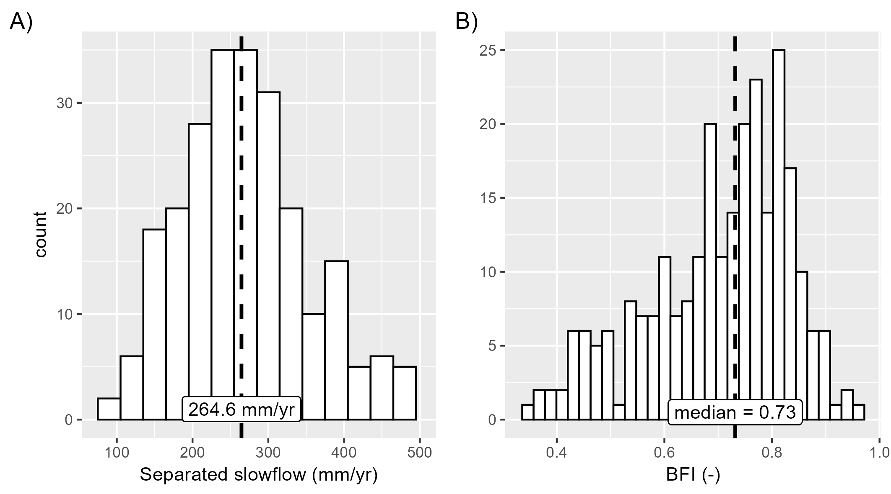

### Spatial distribution

Hydrographs from more than 200 stream gauges within our jurisdiction were separated into *slow-flow* and *quick-flow* components. Each gauge has at least 10 years of record since 2000, with more than 75% of the record complete.

Within the study area, most slow flow by volume is assumed to originate from groundwater discharge to streams through springs, seeps, and gaining stream reaches.

The interactive map below displays one pie chart for each stream gauge. The brown portion represents the relative contribution of slow flow, while the blue portion represents quick flow. The diameter of each pie chart is proportional to the magnitude of mean annual total streamflow.

`Click any pie chart to view the station properties. A full-screen option is available in the upper-left corner.`

<iframe src="https://golang.oakridgeswater.ca/pages/baseflow-piechart.html" width="100%" height="400" scrolling="no" allowfullscreen></iframe>

*Please be patient while the map loads.*

 

The slow-flow component, $(b)$, is estimated as the median baseflow value produced by [14 automated hydrograph-separation techniques](/info/hydrographseparation/).

### Histograms

The distributions of slow flow and baseflow index (BFI) across the stream gauges are summarized in the histograms below. The results indicate that approximately two-thirds of observed streamflow is supplied by groundwater-derived slow flow. This represents roughly 220 mm per year, equivalent to approximately one-quarter of annual precipitation.

