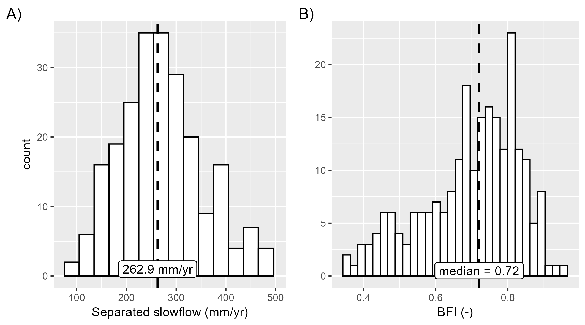

### Spatial distribution

Hydrographs from over 200 stream gauges within our jurisdiction, all having greater than a 10 year period of record occurring sometime since the year 2000 and that is more than 75% complete, have been separated into their *slow flow* and *quick flow* components. Within our jurisdiction, it is assumed that the majority of slow flow (by volume) originates from groundwater sources, i.e., springs, seeps, losing reaches, etc.

Below are a number of pie charts, one for every gauge showing the relative proportion of slow flow (in brown) to quick flow (in blue). The diameter of the pie relates to the magnitude of total annual stream flow.

`click on any pie chart to reveal station properties. Full-screen available in the top-left corner`

<iframe src="https://golang.oakridgeswater.ca/pages/baseflow-piechart.html" width="100%" height="400" scrolling="no" allowfullscreen></iframe>

*please be patient while the map loads*
 

The slow flow portion $(b)$ of the hydrograph is estimated as the median baseflow estimate of [14 automated hydrograph separation techniques](/info/hydrographseparation/).

### Histograms

Below, the results from these gauges are summarized as histograms, revealing that two thirds of observed (total) stream flow comes from groundwater sources, which amounts to roughly 220 mm/yr, a quarter of annual precipitation.

