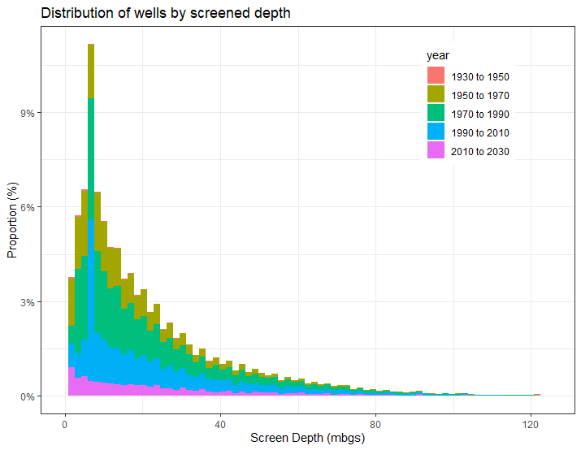

# ORMGP boreholes
Boreholes contained in the ORMGP database:

<iframe src="http://golang.oakridgeswater.ca:8080/pages/cum-bh-cumu.html" width="100%" height="800" scrolling="no" allowfullscreen></iframe>
 

-