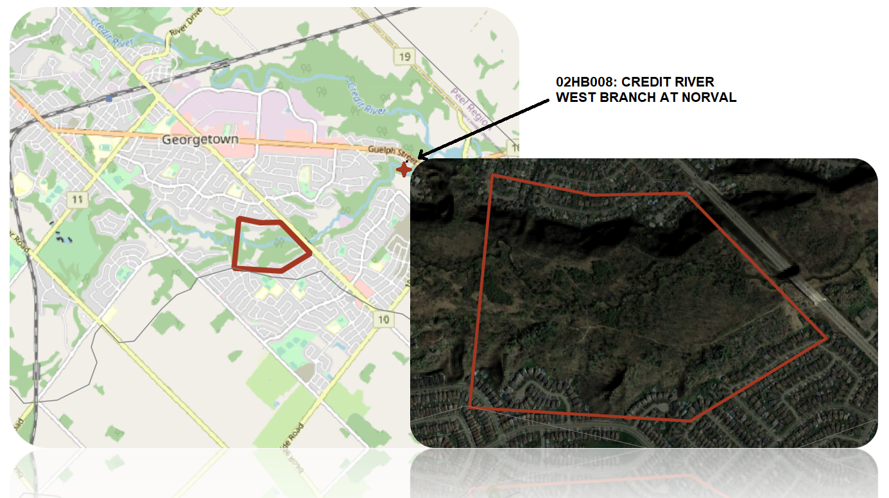
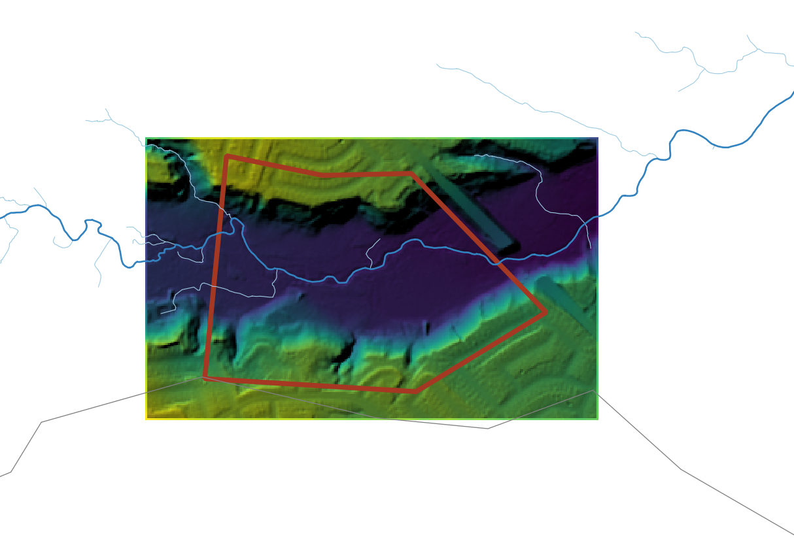
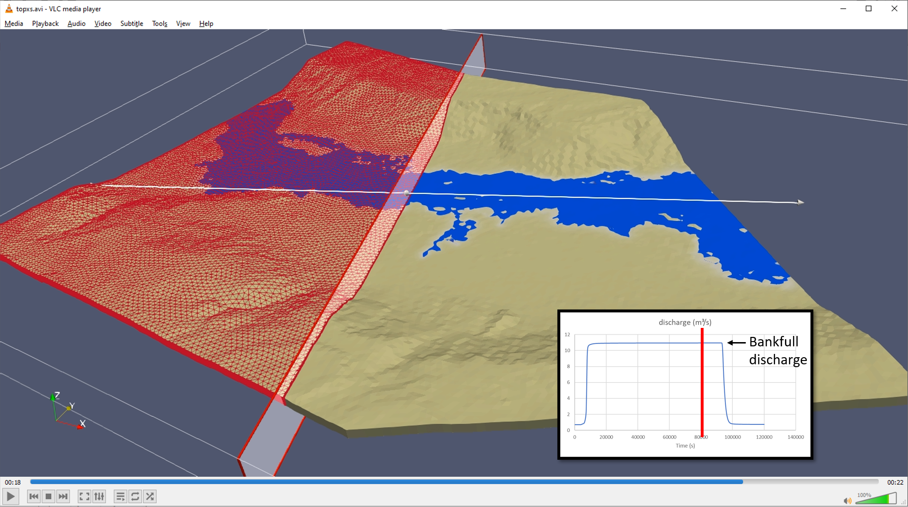
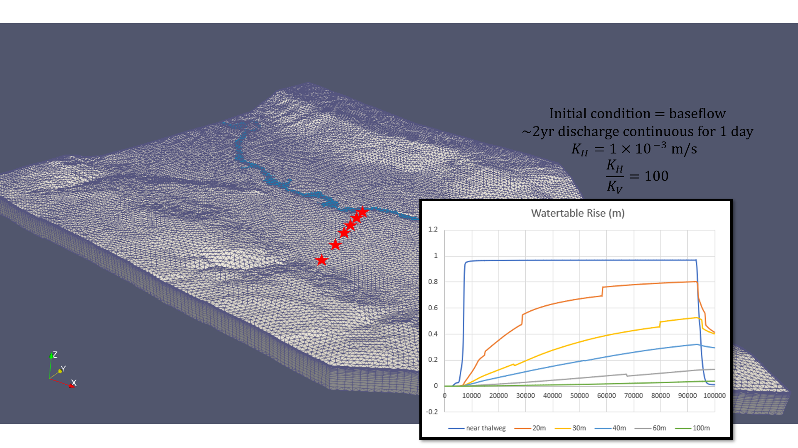

# Cause & Effect

> Modelling with [HydroGeoSphere](https://www.aquanty.com/hydrogeosphere).

Can overland flooding be the cause of groundwater flooding?

*more details to come...*

Site Immdiately downstream of [02HB008: CREDIT RIVER WEST BRANCH AT NORVAL](https://wateroffice.ec.gc.ca/report/real_time_e.html?stn=02HB008) which is included in [ORMGP's Data analysis platform](https://owrc.shinyapps.io/sHyStreamflow/?sID=149227).

# Animations

Lets push a 10-year flood through this reach:

 

Watch the channel's influence on water table elevations, even given highly conductive material properties:

