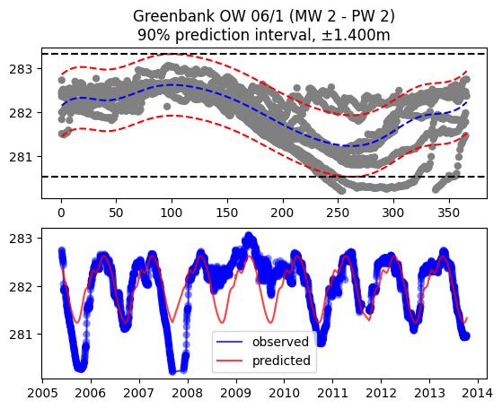

# Introduction

The intention is to determine the variability one should expect when reading [our interpolated water table map](https://owrc.github.io/watertable/). The water table map is a *long-term average* with uncertainty associated with the date measurements were made. Water table depths vary seasonally by more than 1m in many locations and must be taken into account when trying to estimate seasonal high water levels.

Total expected variability is assumed described by 2 components: seasonal variability + inter-annual variability. 
  1. seasonal variability is modelled using a statistical model (below)
  1. inter-annual variability is assessed by the confidence intervals from the statistical model

## Generalized Additive Model

The Generalized Additive Model (GAM) is a flexible means of fitting a model to time series data. It is a generalization of the linear models we've all fitted to point data, which means it retains the ability to efficiently compute confidence intervals and prediction intervals and whose behaviour can be controlled intuitively.

### processing steps

Locations with >34 water level measurements are queried from our database. At every location:

1. water level data are re-sampled to daily averages
1. outliers removed using the ±1.5 * IQR (inter-quartile range) method
1. values are mapped to their 'day-of-year' as the data's sole degrees of variability 
1. values are fitted to a linear Generalized additive model (GAM), using 12 (monthly) degrees of freedom
1. seasonal variability is taken as the amplitude of the GAM
1. 90% prediction intervals are then computed around the GAM, assumed the inter-annual (long-term) variability
1. Total expected variability = seasonal variability + inter-annual variability 

<!-- simultaneous interval for a penalized spline in a fitted Generalized additive model (GAM) -->

[See plots of all locations here.](https://www.dropbox.com/s/35ukkbfu6al25x7/gwvar-summary.pdf?dl=1)

## Map (..takes >1min to load)
`click on any circle to reveal station properties. Full-screen available in the top-left corner`

<iframe src="https://golang.oakridgeswater.ca/pages/gwvar.html" width="100%" height="400" scrolling="no" allowfullscreen></iframe>