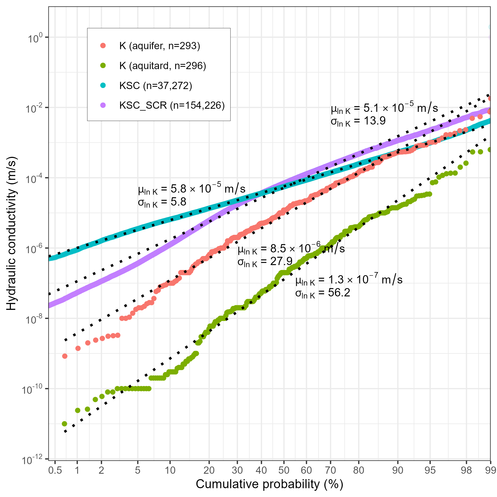
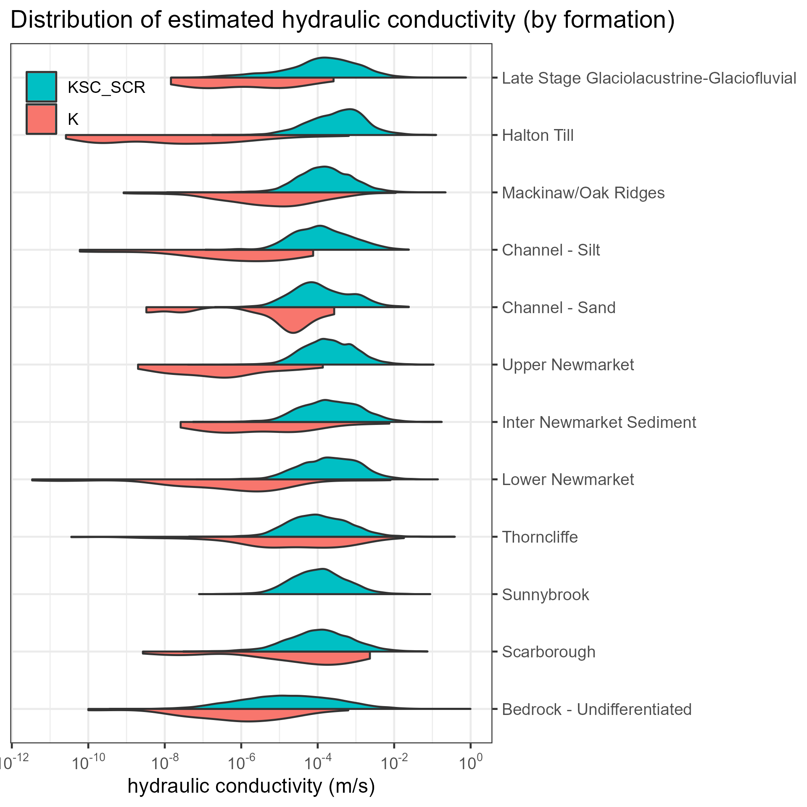

The ORMGP is actively compiling hydrogeologic parameter estimates (e.g., porosity, specific capacity, storativity, transmissivity, hydraulic conductivity) into the program's database. To date, activities have focussed on collation of hydraulic conductivity (K) and specific capacity (SC) estimates. Further information on the use of water well specific capacity tests to estimate transmissivity and hydraulic conductivity can be found in Theis et al. (1963), Walton (1970), Bradbury and Rothschild (1985), Domenico and Schwartz (1990), Richard et al. (2016), and Priebe et al. (2018). For the ORMGP study area, the specific capacity estimates are being extended into estimates of transmissivity (T) and hydraulic conductivity (K) utilizing the methodology of Bradbury and Rothschild (1985). Further information of methodology is included in the [program's database manual](https://owrc.github.io/database-manual/Contents/TOC.html).

1. K - estimates of hydraulic conductivity (K) from slug tests on piezometers/wells (Units = m/s). Locations with K estimates from slug test analysis are shown on Figure 1;
1. SPEC_CAP - specific capacity (pumping rate/maximum drawdown) estimates from data obtained during short-term pumping tests (<4 hours) conducted by well drillers following well installation (Units = L/minute/m). Locations with specific capacity (SC) estimates are shown on Figure 2. The cumulative probability plot of the data is shown on Figure 3;
1. TSC - Transmissivity (T) estimates from specific capacity (SC) estimates according to the methodology of Bradbury and Rothschild (1985) which allows for corrections for partial penetration of well screen and incorporates estimates of formation thickness (Units = m2/s; Figure 3);
1. KSC - estimates of hydraulic conductivity (K) from specific capacity (SC) estimates utilizing methodology of Bradbury and Rothschild (1985). Cumulative probability plot of the data shown on Figure 4 (Units = m/s);
1. TSC_SCR - estimates of Transmissivity (T) from specific capacity (SC) estimates utilizing methodology of Bradbury and Rothschild (1985). The formation thickness is taken as the screen length (Units = m2/s; Figure 3); and
1. KSC_SCR - estimates of hydraulic conductivity (K) from specific capacity (SC) estimates (Figure 4) utilizing methodology of Bradbury and Rothschild (1985). The formation thickness is taken as the screen length (Units = m/s).

## Interactive maps

> Please note that each map below takes around minute to load, so please be patient; there are >150,000 locations found with specific capacity being rendered.

`Hint: full-screen available in the top-left corner`

<iframe src="https://golang.oakridgeswater.ca/pages/hydraulicproperties-k.html" width="100%" height="400" scrolling="no" allowfullscreen></iframe>

*Figure 1: Map of hydraulic conductivity (K) estimates within the ORMGP information and analysis system. (be patient)*
  

<iframe src="https://golang.oakridgeswater.ca/pages/hydraulicproperties-se.html" width="100%" height="400" scrolling="no" allowfullscreen></iframe>

*Figure 2: Map of specific capacity (SC) estimates within the ORMGP information and analysis system. (be patient)*
  

## Cumulative Probability plots
`Hint: right-click to copy as image`

*Figure 3: Cumulative probability plot showing SPEC_CAP, TSC, and TSC_SCR (m²/s).*

 

*Figure 4: Cumulative probability plot showing K, KSC and KSC_SCR (m/s).*

## Distributions
`Hint: right-click to copy as image`

*Figure 5: Distribution of conductivities by formation. Upper distribution KSC; Lower distribution KSC_SCR*

 

*Table 1: Summary distribution statistics of hydraulic conductivity (m/s).*

| Formation | estimate | n | mean | geomean | median |
|---|---:|---:|---:|---:|---:|
| Late Stage Glaciolacustrine-Glaciofluvial | K | 14 | 2.45E-05 | 1.2E-06 | 2.1E-06 |
|  | KSC_SCR | 3417 | 1.11E-03 | 1.2E-04 | 1.5E-04 |
| Halton Till | K | 106 | 1.54E-05 | 2.4E-08 | 2.0E-08 |
|  | KSC_SCR | 1446 | 1.24E-03 | 3.2E-04 | 3.7E-04 |
| Mackinaw/Oak Ridges | K | 152 | 1.70E-04 | 5.4E-06 | 6.7E-06 |
|  | KSC_SCR | 13942 | 6.59E-04 | 1.6E-04 | 1.5E-04 |
| Channel - Silt | K | 18 | 9.48E-06 | 5.7E-07 | 1.1E-06 |
|  | KSC_SCR | 873 | 5.68E-04 | 1.3E-04 | 1.2E-04 |
| Channel - Sand | K | 10 | 4.67E-05 | 5.5E-06 | 1.9E-05 |
|  | KSC_SCR | 1389 | 6.00E-04 | 1.2E-04 | 9.9E-05 |
| Upper Newmarket | K | 19 | 1.02E-05 | 3.3E-07 | 3.4E-07 |
|  | KSC_SCR | 13734 | 7.50E-04 | 2.0E-04 | 1.9E-04 |
| Inter Newmarket Sediment | K | 21 | 4.01E-04 | 3.5E-06 | 1.0E-06 |
|  | KSC_SCR | 6111 | 9.74E-04 | 2.1E-04 | 2.1E-04 |
| Lower Newmarket | K | 61 | 1.83E-04 | 4.4E-07 | 7.7E-07 |
|  | KSC_SCR | 11657 | 8.81E-04 | 2.1E-04 | 2.2E-04 |
| Thorncliffe | K | 79 | 6.04E-04 | 1.8E-05 | 3.3E-05 |
|  | KSC_SCR | 10254 | 6.43E-04 | 1.1E-04 | 1.0E-04 |
| Sunnybrook | K | 1 | 9.11E-07 | 9.1E-07 | 9.1E-07 |
|  | KSC_SCR | 6971 | 4.62E-04 | 1.1E-04 | 1.1E-04 |
| Scarborough | K | 31 | 3.51E-04 | 2.4E-05 | 9.2E-05 |
|  | KSC_SCR | 6928 | 6.90E-04 | 1.1E-04 | 1.2E-04 |
| Bedrock - Undifferentiated | K | 53 | 2.23E-05 | 7.1E-07 | 1.0E-06 |
|  | KSC_SCR | 77114 | 5.33E-04 | 1.7E-05 | 1.7E-05 |

# References

Bradbury, K.R., and Rothschild, E.R. 1985. A computerized technique for estimating the hydraulic conductivity of aquifers from specific capacity data. Ground Water, 23(2), 240-246.

Domenico, P.A., and Schwartz, F.W. 1990. Physical and Chemical Hydrogeology. John Wley & Sons, Inc., 824p.

Priebe, E.H., Neville, C.J., and Rudolph, D.L. 2018. Enhancing the spatial coverage of a regional high-quality hydraulic conductivity dataset with estimates made from domestic water-well specific-capacity tests. Hydrogeology Journal, 26, 395-405.

Richard, S.K., Chesnaux, R., Rouleau, A., and Coupe, R.H. 2015. Estimating the reliability of aquifer transmissivity obtained from specific capacity tests: examples from the Saguenay-Lac-Saint-Jean aquifers, Canada. Hydrological Sciences Journal, 61(1), 173-185.

Theis, C.V., Brown, R.H., and Meyer, R.R. 1963. Estimating the transmissivity of aquifers from the specific capacity of wells. In R. Bental (compiler), Methods of determining permeability, transmissivity, and drawdown. U.S. Geological Survey Water-Supply Paper 1536-I, p331-341.

Walton, W.C. 1970. Groundwater Resource Evaluation. McGraw-Hill Book Company. 664p.
