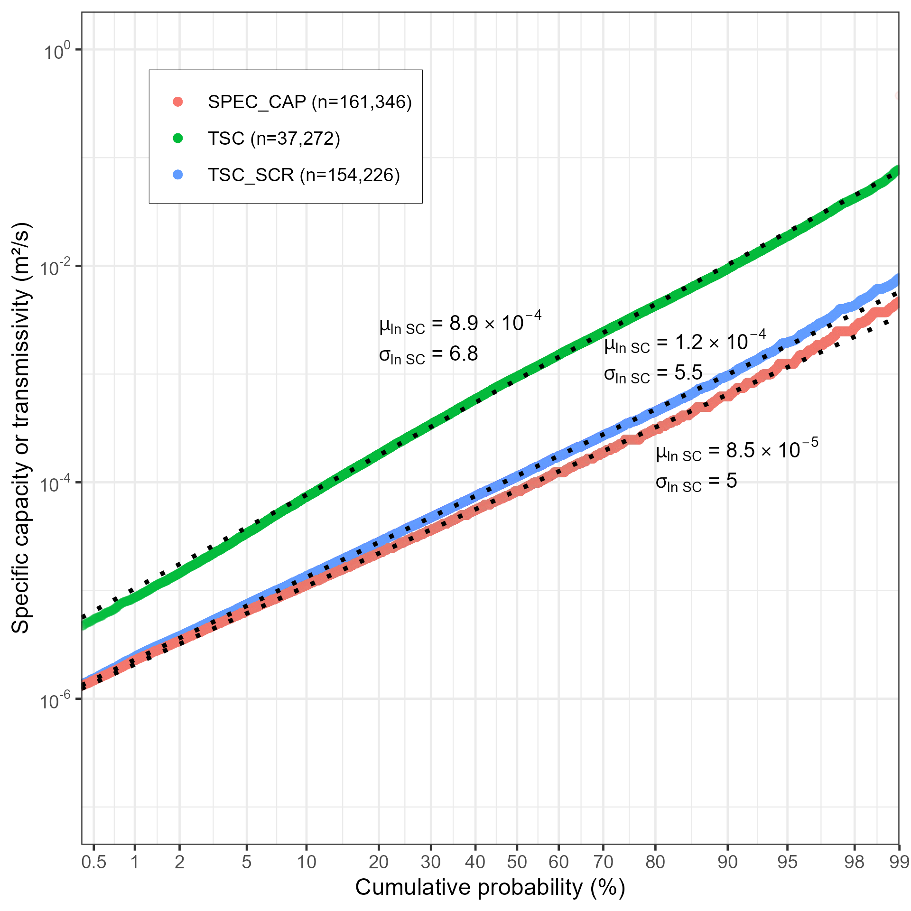

The ORMGP is actively compiling hydrogeologic parameter estimates (e.g., porosity, specific capacity, storativity, transmissivity, hydraulic conductivity) into the program's database. To date, activities have focussed on collation of hydraulic conductivity (K) and specific capacity (SC) estimates. The specific capacity estimates are being extended into estimates of transmissivity (T) and hydraulic conductivity (K) utilizing the methodology of Bradbury and Rothschild (1985). Further information of methodology is included in the [program's database manual](https://owrc.github.io/database-manual/Contents/TOC.html).

1. K_MS - estimates of hydraulic conductivity (K) from slug tests on piezometers/wells (Units = m/s). Locations with K estimates from slug test analysis are shown on Figure 1;
1. SPEC_CAP_LPMM - specific capacity (pumping rate/maximum drawdown) estimates from data obtained during short-term pumping tests (<4 hours) conducted by well drillers following well installation (Units = L/minute/m). Locations with specific capacity (SC) estimates are shown on Figure 2. The cumulative probability plot of the data is shown on Figure 3;
1. TSC_M2S - Transmissivity (T) estimates from specific capacity (SC) estimates according to the methodology of Bradbury and Rothschild (1985) which allows for corrections for partial penetration of well screen and incorporates estimates of formation thickness (Units = m2/s; Figure 3);
1. KSC_MS - estimates of hydraulic conductivity (K) from specific capacity (SC) estimates utilizing methodology of Bradbury and Rothschild (1985). Cumulative probability plot of the data shown on Figure 4 (Units = m/s);
1. TSC_SCR_M2S - estimates of Transmissivity (T) from specific capacity (SC) estimates utilizing methodology of Bradbury and Rothschild (1985). The formation thickness is taken as the screen length (Units = m2/s; Figure 3); and
1. KSC_SCR_MS - estimates of hydraulic conductivity (K) from specific capacity (SC) estimates (Figure 4) utilizing methodology of Bradbury and Rothschild (1985). The formation thickness is taken as the screen length (Units = m/s).

## Interactive maps

> Please note that each map below takes around minute to load, so please be patient; there are >150,000 locations found with specific capacity being rendered.

`Hint: full-screen available in the top-left corner`

<iframe src="https://golang.oakridgeswater.ca/pages/hydraulicproperties-k.html" width="100%" height="400" scrolling="no" allowfullscreen></iframe>

*Figure 1: Map of hydraulic conductivity (K) estimates within the ORMGP information and analysis system. (be patient)*
  

<iframe src="https://golang.oakridgeswater.ca/pages/hydraulicproperties-sc.html" width="100%" height="400" scrolling="no" allowfullscreen></iframe>

*Figure 2: Map of specific capacity (SC) estimates within the ORMGP information and analysis system. (be patient)*
  

## Cumulative Probability plots
`Hint: right-click to copy as image`

*Figure 3: Cumulative probability plot showing SPEC_CAP_LPMM (but units translated from L/min/m to m2/s), TSC_M2S, and TSC_SCR_M2S.*

 

*Figure 4: Cumulative probability plot showing K_MS, KSC_MS and KSC_SCR_MS.*

# References

Bradbury, K.R., and Rothschild, E.R. 1985. A computerized technique for estimating the hydraulic conductivity of aquifers from specific capacity data. Ground Water, 23(2), 240-246