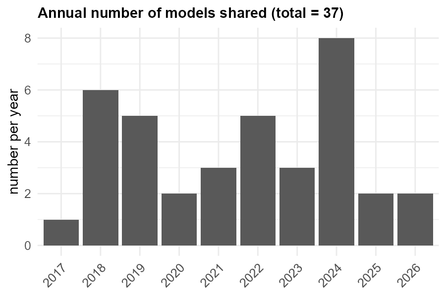

The [Oak Ridges Moraine Groundwater Program](https://www.oakridgeswater.ca/) maintains an archive of existing watershed-scale numerical models through the ORMGP **Model Custodianship Program**. The purpose of the program is to preserve model files, supporting data, reports, and related knowledge so that previous modelling investments can continue to support water-resource studies, source-water protection, environmental assessments and related planning work.

To date, the ORMGP has received and reviewed 100 sets of numerical model files, not including derivatives of existing models. These files have been checked for consistency, including missing or corrupt files, and many have been rebuilt or reorganized into an operational, self-contained file structure that is easier to understand, run, archive and share.

The program follows the philosophy outlined in the [Guide for Actively Managing Watershed-Scale Numerical Models in Ontario](https://www.oakridgeswater.ca/wp-content/uploads/2024/11/A-Guide-for-Actively-Managing-Watershed-Scale-Numerical-Models-in-Ontario.pdf) (2017). The guide treats numerical models as long-term knowledge infrastructure: public assets that require active management, clear documentation, periodic review and responsible sharing.

### What the program provides

The Model Custodianship Program helps partner agencies and qualified users by:

1. maintaining an inventory of available numerical models and their geographic extents;
2. preserving model files, reports, supporting data, and run instructions where available;
3. checking delivered model packages for completeness and usability;
4. organizing files into a consistent structure to support future use; and
5. tracking model redistribution so that the ORMGP can understand how models are being reused, updated or extended.

Model sharing also supports transparency and avoids unnecessary duplication of publicly funded modelling work. Where appropriate, shared models allow practitioners to build from an existing regional understanding rather than starting again from the beginning.

### Model types

The ORMGP does not prescribe a single modelling code or workflow. Consultants and agencies use a variety of tools depending on the study purpose, scale, available data, and internal expertise. With support from municipal partners, the ORMGP maintains access to several model codes and third-party user interfaces so that archived models can be reviewed and, where possible, run.

The archived models are primarily water-resource models, including long-term continuous distributed hydrologic models, groundwater-flow models, integrated surface-water/groundwater models, and related coupled modelling frameworks.

For source-water protection and related studies, archived models generally fall into four categories:

1. *Hydrologic models* use climate information, such as precipitation and temperature, together with land-surface characteristics, such as soil type, land use, and imperviousness, to estimate processes such as evapotranspiration, snowmelt, groundwater recharge, and runoff.
2. *Groundwater-flow models* represent the subsurface in two or three dimensions and simulate how groundwater moves through aquifers and aquitards. These models commonly rely on recharge estimates produced by hydrologic or integrated models.
3. *Integrated models* simulate surface-water and groundwater processes within a single model, reducing the need to pass information between separate models.
4. *Coupled models* use separate hydrologic and groundwater-flow models to represent interactions between surface-water and groundwater systems. These models may exchange information iteratively, allowing one model to provide feedback to the other.

#### Model map

The map below shows the approximate boundaries of models currently tracked by the program. Clicking a model boundary displays available attributes. Model reports and model files may be made available to [partner agencies](https://www.oakridgeswater.ca/ormgp-who-we-work-with/) and other approved users for water-related studies, subject to review and completion of the ORMGP Model Sharing Agreement.

The map below shows the approximate boundaries of models currently tracked by the program. Clicking a model boundary displays available attributes. Model reports are made available to [partner agencies](https://www.oakridgeswater.ca/ormgp-who-we-work-with/) and other approved users for water-related studies. Model files are subject to review and completion of the ORMGP *Model Sharing Agreement*. 

This includes municipal and conservation authority staff who require regional geological and hydrogeological context to support decisions related to water supply, well interference, flooding, water quality, land development, fisheries, and other water-resource issues. It may also include qualified consultants working on behalf of approved agencies, allowing them to access existing data, interpretations and model files so that effort can be focused on project-specific analysis rather than reassembling foundational information.

`Full-screen mode available in the top-left corner`

<iframe src="https://golang.oakridgeswater.ca/pages/numerical-model-custodianship-program.html" width="100%" height="400" scrolling="no" allowfullscreen></iframe>

 

#### Model codes

Model codes currently maintained or supported include:

* [FEFLOW](https://www.dhigroup.com/technologies/mikepoweredbydhi/feflow)
* [MODFLOW](https://www.usgs.gov/mission-areas/water-resources/science/modflow-and-related-programs)
* [MIKE SHE](https://www.dhigroup.com/technologies/mikepoweredbydhi/mike-she)
* [GSFLOW](https://www.usgs.gov/software/gsflow-coupled-groundwater-and-surface-water-flow-model)
* [PRMS](https://www.usgs.gov/software/precipitation-runoff-modeling-system-prms)
* [HSPF](https://19january2021snapshot.epa.gov/ceam/hydrological-simulation-program-fortran-hspf_.html)
* [HydroGeoSphere](https://www.aquanty.com/hydrogeosphere)
* [Raven](http://raven.uwaterloo.ca/)

## Requesting model files

Access to numerical model files is managed through a model-sharing process. Requests should identify the model or area of interest, the intended use of the model, the requesting organization, and the water-resource study or project for which the model is needed.

[__Request numerical model files using this form__](https://arcg.is/1OzLfX), or [contact the ORMGP](https://www.oakridgeswater.ca/contact-us/).

Before files are released, requesters are required to complete a Model Sharing Agreement. The agreement helps indemnify the parties that created, own, distribute, and use the model files. It also allows the ORMGP to track model reuse and to understand when model-derived updates, data corrections, or new interpretations may be useful for future water resource management.

Model users are responsible for determining whether a shared model is appropriate for their intended application. A model may have been developed for a specific purpose, scale, time period, or decision context, and it may not be suitable for all future uses without review, modification, or recalibration. Any limitations, assumptions, uncertainty, software requirements, or data gaps should be considered before relying on model results.

As of the initiation of the program in 2017, 37 models have been redistributed and applied to water-resource studies.

