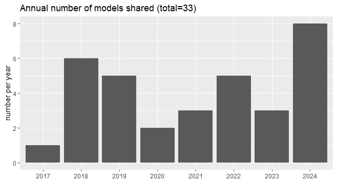

The [Oak Ridges Moraine Groundwater Program](https://www.oakridgeswater.ca/) actively maintains an archive of existing numerical models called the ORMGP **Model Custodianship Program**. To date, 90 sets of numerical model files have been received and checked for consistency (search for missing/corrupt files, etc.). Many have been "re-built" and re-organized from their original/delivered form into an operational file structure that is intuitive and self contained such that the sharing of the model file can be made effectively.

We have since published our direction in the [Guide for Actively Managing Watershed-Scale Numerical Models in Ontario](https://www.oakridgeswater.ca/_files/ugd/4a0a6e_c41c71a481ea4657806e1fbb0c912f7a.pdf) (2017) and continue to maintain its philosophy.

### Model codes

The ORMGP is aware that 3rd party/consultants maintain independent workflows and internal expertise that it would be restrictive for this model custodianship program to specify a particular model code . Instead, and with the support of our municipal partners, we maintain software licenses for a variety of model codes and third-party user interfaces.  

The models we maintain typically remain in the hydrological realm, including long-term continuos surface-water/groundwater integrated models and regional models used to manage and protect our groundwater resources. 

For source water protection, the models we archive can be typically categorized as:

1. *Hydrologic* models: *(i)* take climatological information (i.e, precipitation, temperature, etc.); *(ii)* make estimates of other climatic processes (potential evaporation, snowmelt, etc.); and *(iii)* take land surface characteristics (imperviousness, use type, soil type, etc.) to project likely quantities of evapotranspiration, groundwater recharge, and overland runoff.
1. *Groundwater* flow models take a 3D representation of the sub-surface and provide estimates of how water migrates underground. Among many things, the groundwater model requires estimates of *groundwater recharge*, as it is a major source of water into the groundwater system.
1. *Integrated* models are a newer technology which include all of the processing of Hydrologic and Groundwater models in one, saving the need to working with many models.
1. *Coupled* models are such projects where multiple models were required to gain an understanding of the surface-water/groundwater interaction. These models often work in conjunction iteratively, as both models can be made to provide feedback.

#### Map

When a model boundary polygon is `clicked` attributes of the model are displayed. Access to model reports and the files for running of the model are available to our partner agencies for any water related study. One may access the model once they've agreed to our Model Sharing Agreement, please [contact us](https://www.oakridgeswater.ca/contact-us) for more details.

`Full-screen mode available in the top-left corner`

<iframe src="https://golang.oakridgeswater.ca/pages/numerical-model-custodianship-program.html" width="100%" height="400" scrolling="no" allowfullscreen></iframe>

 

#### Codes
Model codes currently maintained/licensed include:

* [FEFLOW](https://www.mikepoweredbydhi.com/products/feflow)
* [MODFLOW](https://www.usgs.gov/mission-areas/water-resources/science/modflow-and-related-programs)
* [MIKE SHE](https://www.mikepoweredbydhi.com/products/mike-she)
* [GSFLOW](https://www.usgs.gov/software/gsflow-coupled-groundwater-and-surface-water-flow-model)
* [PRMS](https://www.usgs.gov/software/precipitation-runoff-modeling-system-prms)
* [HSP-F](https://www.epa.gov/ceam/hydrological-simulation-program-fortran-hspf)
* [HydroGeoSphere](https://www.aquanty.com/hydrogeosphere)
* [Raven](http://raven.uwaterloo.ca/)

### Model sharing

All requests for model codes have required the singing of a Model Sharing Agreement. This is an agreement to indemnify all parties, those who created the model, those who own the model, those who distribute the model and the users. But better yet, it lets us keep track of model (re-)usage supported by the ORMGP.

[__Request for numerical model(s) can be made here__](https://arcg.is/1OzLfX).

As of the initiation of the program since 2017, a total of 23 models have been successfully redistributed and applied to water resource studies.

