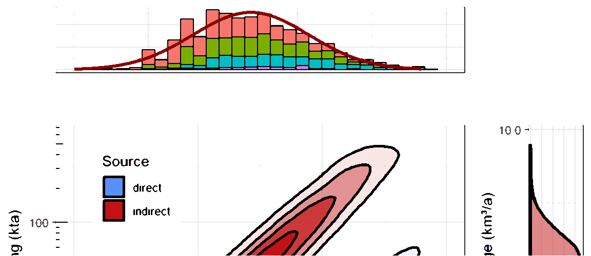
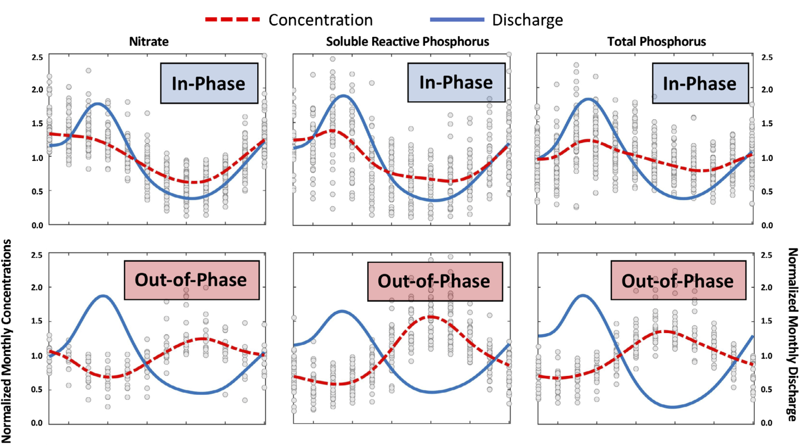
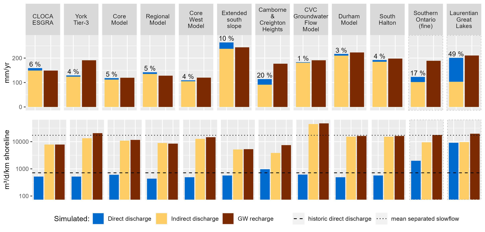
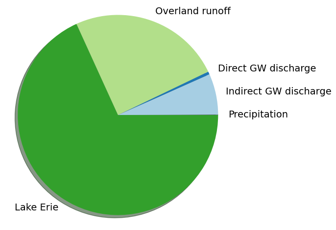
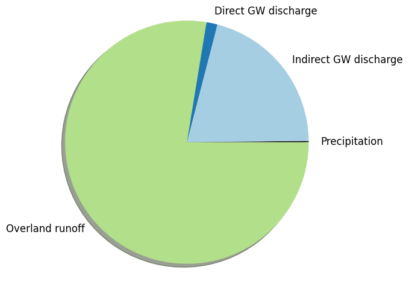

<!--  -->


```{r setup, include=FALSE}
knitr::opts_chunk$set(echo = TRUE)

library(dplyr)
library(tidyr)
library(ggplot2)
library(ggspatial)
library(grid)
library(gridExtra)
library(cowplot)
library(ggpubr)
library(sf)
library(rgdal)
library(geojsonio)
library(leaflet)
library(leaflet.extras)
library(leaflet.minicharts)
library(leaflegend)
library(scales)
library(viridis)
library(shadowtext)
library(units)
library(lubridate)
library(stringr)
library(MASS)
library(Kendall)
library(rnaturalearth)
library(odbc)
```

```{r dbconnect, include=FALSE}
source("../ycdb-connect.R", local = knitr::knit_global())
```

```{r loadgeospatial, include=FALSE}
source("sup/load-geospatial.R", local = knitr::knit_global())
```

```{r query, include=FALSE}
source("sup/load-querydata.R", local = knitr::knit_global())
```

```{r basemap, include=FALSE}
source("sup/load-basemap.R", local = knitr::knit_global())
```


The role of regional groundwater systems on the Great Lakes is investigated along Lake Ontario’s north shore. Given that the [ORMGP](https://www.oakridgeswater.ca/) jurisdiction covers much of Lake Ontario's north shore catchment area, we have been approached to apply our [database](https://owrc.github.io/database-manual/Contents/TOC.html) and [numerical models](https://owrc.github.io/snapshots/md/numerical-model-custodianship-program.html) to proportion chloride (salt) loadings from a variety of sources with specific attention to *direct* groundwater discharge along the lake shore. 

Direct groundwater discharge to Lake Ontario (along the shoreline) remains considerably uncertain, with some historical estimates provided by Haefeli (1970; 1972), Singer (1974), Ostry (1979), Ostry and Singer (1981), McCulloch (1973), and Hodge (1978). 

Our analysis suggests long-term direct groundwater discharge loadings range from 2-14 kilotonnes/year of chloride to the north shore of Lake Ontario.  *Indirect* loadings via groundwater discharge to streams along the north shore are estimated to contribute an additional 10-50 kilotonnes/year of chloride. 

When correcting for drainage area, groundwater-sourced loadings amount to 100-600 kilotonnes/year. For context, chloride loadings from all sources to Lake Ontario (groundwater, surface water, contaminant point sources, etc., yet *ex*cluding inflow from Lake Erie) are estimated to range from 1700-2500 kilotonnes/year (Chapra et al., 2009).

[*read 2022 hard-copy report here*](https://www.oakridgeswater.ca/_files/ugd/4a0a6e_aeb10d08850e431288e7495948c9d8d5.pdf)

# The North Shore

From the Trent river east, the northern catchments drain into the Bay of Quinte, which then mix with Lake Ontario near its easterly outlet. So for the most part, the northern ~225km shoreline that extends from Hamilton to Belleville is here considered the "north shore".

This leaves only a 6,520 km² drainage area of the 64,030 km² Lake Ontario catchment (`r round(652/6403*100,0)`% by areal cover, purple-ish area below), while covering (at least) `r round(225/1020*100,0)`% of Lake Ontario's entire shoreline. 


```{r, file="sup/map-greatlakes.R", echo=FALSE, message=FALSE, warning=FALSE}
```


```{r calcs1, include=FALSE}
da <- set_units(6520, km^2)
wb <- (set_units(1,1)-(st_area(drainage.area.builtup)+st_area(drainage.area.grnblt))/da)*100
```

The North Shore is relatively urbanized being centered on Toronto. With almost half of north shore protected as greenbelt (`r round(st_area(drainage.area.grnblt)/da*100,0)`%), the remaining land used is split between the existing developed land and the "whitebelt" areas (lands both un-developed and un-protected), `r round(st_area(drainage.area.builtup)/da*100,0)`% and `r round(wb,0)`%, respectively. The total length of mapped roads within the north shore catchment area (not shown) is a little over `r format(round(sum(drainage.area.roads$length)/1000,-3), big.mark=",")` km.

```{r, file="sup/map-site-local.R", echo=FALSE, message=FALSE, warning=FALSE, fig.width=10}
```

*Land use designations within the North Shore catchment area.*

<br>


## Road salt application

For context, rates of municipal road salt application are 11.6 tonnes per kilometer serviced roads. Accounting for the road length along the North Ontario shore, this amounts to 290 kta road salt, and that's not counting for private application (residences, parking lots, etc.).


```{r application, echo=FALSE, message=FALSE, warning=FALSE, fig.height=4}
readRDS("dat/application.rds") %>%
  mutate(rate=Total.Quantity.of.Road.Salts..tonnes./Road.Length.Serviced..km.) %>%
  ggplot(aes(x=rate)) +
    theme_bw() +
    theme(axis.title.y = element_blank(),
                       axis.text.y = element_blank(),
                       legend.title = element_blank()) +
    geom_density(aes(color=as.factor(Year)), size=.75) +
    geom_vline(xintercept = 11.6, linewidth=1, linetype='dotted', alpha=.7) +
    annotate("text",x=12,y=0, label="median=11.6",hjust = 0) +
    xlim(c(NA,100)) +
    labs(title="Annual municipal road salt application rates", x="Road salt application (tonne/km)")
```

<font size="3">*From: Products Division, Environment and Climate Change Canada (2021)*</font>

<br>

# Data collection

As of this [snapshot](https://owrc.github.io/snapshots/), `r nr(dft)` chloride samples were present in the [**ORMGP database**](/database-manual/Contents/TOC.html), of which `r nr(df)` (from `r nr(dfg)` locations) had screen information and were taken from areas assumed to be up-gradient of Lake Ontario.


```{r, file="sup/map-site-data.R", echo=FALSE, message=FALSE, fig.width=10}
```

*Locations of Chloride samples grouped by their source. Shaded in grey is the contributing area and stretch of Lake Ontario shoreline being investigated.*

<br>


## Categorization

Locations fell into 4 categories:

1. deep wells (screened depth>20m)
1. shallow wells (screened depth<20m)
1. surface water (mostly PQMN)
1. unknown (or not yet classified)

<br>

And were assigned to the regional formations:

1. Late Stage Glaciolacustrine-Glaciofluvial
1. Halton Till
1. Mackinaw/Oak Ridges
1. Channel---Silt
1. Channel---Sand
1. Upper Newmarket
1. Inter Newmarket Sediment
1. Lower Newmarket
1. Newmarket Till/Northern Till
1. Thorncliffe
1. Sunnybrook
1. Scarborough
1. Bedrock---Undifferentiated


> At every location, the **maximum measured** Chloride value was collected. 

This was (primarily) to counter the complication of handling seasonal concentration regimes:



<font size="3">*Van Meter et.al., (2019)*</font>


<br>

## Chloride concentrations

```{r functions, include=FALSE}
source("sup/func-scaletransformation.R", local = knitr::knit_global())
```


```{r build fit, include=FALSE}
fit <- fitdistr(dfg$VALUE, "lognormal")
med = median(dfg$VALUE)
p5 = qlnorm(.05, mean = fit$estimate[[1]], sd = fit$estimate[[2]])
p95 = qlnorm(.95, mean = fit$estimate[[1]], sd = fit$estimate[[2]])
# print(fit$estimate[[1]])
# print(fit$estimate[[2]]) 
```
  
  
  
The distribution of all maximum measured Chloride [mg/L] looks log-normally distributed, with a mean of `r round(exp(fit$estimate[[1]]),1)` mg/L (n = `r nr(dfg)`).  Each bin is then colour-coded to the measurement source.
  
  
  
  
```{r, file="sup/source-conc-histogram.R", echo=FALSE, message=FALSE, warning=FALSE}
```


### Distribution by source

```{r, file="sup/source-conc-density.R", echo=FALSE, message=FALSE, warning=FALSE}
```

The distributions are compared using a two-sample Kolmogorov-Smirnov (KS) test. The KS tests whether two distributions can be said come from the same population, this is deemed true when the p-value>0.05. 

```{r, file="sup/source-conc-Kolmogorov-Smirnov.R", echo=FALSE, message=FALSE, warning=FALSE}
```

It appears that only the deep groundwater and unknown sources can be said come from the same distribution. Unknown--surface also show some possibility. It is the shallow water sources that appear to differ the most, which is (interestingly) showing lower concentrations. Normally shallow wells tend to have higher concentrations, however these shallow wells are mostly located to the north, within the Oak Ridges Moraine area up-gradient from major urbanization.


### Distribution by formation

In a similar fashion, distributions are presented on the basis of which geological formation the samples were taken from.

```{r layers_ordered, include=FALSE}
layers_ordered <- c(
  "Late Stage Glaciolacustrine-Glaciofluvial",
  "Halton Till",
  "Mackinaw/Oak Ridges",
  "Channel - Silt",
  "Channel - Sand",
  "Upper Newmarket",
  "Inter Newmarket Sediment",
  "Lower Newmarket",
  "Newmarket Till/Northern Till",
  "Thorncliffe",
  "Sunnybrook",
  "Scarborough",
  "Bedrock - Undifferentiated",
  "unknown"
)
```

```{r, file="sup/formation-conc-density.R", echo=FALSE, message=FALSE, warning=FALSE}
```

In general, the KS test seems to imply that the samples are indistinguishable by formation, as the KS test rarely reject the null hypothesis.

```{r, file="sup/formation-conc-Kolmogorov-Smirnov.R", echo=FALSE, message=FALSE, warning=FALSE}
```


### Distribution by sampling date.

Seasonal declines in water quality sample have been observed in winter months (Mazumder et.al., 2021). This decline is apparent with our data, mainly for surface water samples, however there's no apparent need to reduced the dataset on the basis of sampling date .


```{r, file="sup/sample-date-histogram.R", echo=FALSE}
```


## Chloride trend

Finally, mapped water quality locations having greater than 100 measurements, spread over 10 years were tested for temporal trends. It quite clear that groundwater chloride concentrations are on the rise.


```{r, file="sup/map-conc-mannkendall.R", echo=FALSE, message=FALSE, fig.width=10}
```


# Numerical modelling

## Great Lakes Intake Program

Since the mid 70s, drinking water intakes along the great lakes began  collecting continuous water quality measurements at a point when Great Lake chloride levels were at their maximum. Since then there was a steady decline until the mid 90s a slight incline until about 2005, when chloride levels look to steady. The data made available (and shown below) are posted through 2019. 

```{r, file="sup/GLIP.R", echo=FALSE, warning=FALSE, message=FALSE, fig.width=10, fig.height=8}
```

From this, the current steady concentration of Lake Erie $(c_\text{e})$ and Lake Ontario $(c_\text{o})$ are set to 18 and 22.5 mg/L, respectively.


## Hydrograph separation

Next, indirect groundwater discharge is estimated using hydrograph separation. Stream flow measurements in the North Shore contributing area are "separated" into their constituent components: groundwater discharge and overland runoff [using automated proceedures](https://owrc.github.io/info/hydrographseparation/).

```{r, file="sup/baseflow-piechart.R", echo=FALSE, warning=FALSE, message=FALSE}
```

```{r, file="sup/baseflow-histogram.R", echo=FALSE, warning=FALSE, message=FALSE, fig.width=10}
```


## 3D groundwater flow models

Numerical groundwater flow models give insight into the proportion of groundwater originating from either *direct* sources (along the Lake Ontario shoreline) or *indirect* sources via groundwater discharge to streams.


```{r, file="sup/numerical-models.R", echo=FALSE, warning=FALSE, message=FALSE}
```



Two things to conclude here:

1. groundwater discharge estimates from the numerical models is on par with the hydrograph separation estimates, and
1. *direct* source are roughly an order of magnitude less than *indirect* sources.


## Steady-state Great Lakes model

Using a simple water balance model following Capra etal. (2009) is used to validate the results and determine the groundwater chloride contribution relative to other sources:

$$
    V_\text{o}\frac{\mathrm{d}c_\text{o}}{\mathrm{d}t}=W_\text{o}(t)+Q_\text{e}(t)c_\text{e}-Q_\text{o}(t)c_\text{o}
$$

Assuming a steady-state conditions $\frac{\mathrm{d}c_\text{o}}{\mathrm{d}t}=0$, and breaking up the loading term $W_\text{o}$ into 3 constituent components: precipitation $(P_\text{o})$, overland runoff $(R_\text{o})$, and groundwater discharge $(G_\text{o})$. 

$$
  c_\text{runoff} = \frac{P_\text{o}c_\text{precip}+G_\text{o}c_\text{gw}+Q_\text{e}c_\text{e}-Q_\text{o}c_\text{o}}{-R_\text{o}}
$$

Solving for the chloride concentration of runoff (the last unknown) yields 220 mg/L cl$^-$. The overall proportions of chloride loadings to Lake Ontario (along the north shore):



and without Lake Erie:




# Results

After all that, we have:

1. From observation: distribution (statistical model) of groundwater chloride concentrations
1. From hydrograph separation: distribution (statistical model) of indirect discharge
1. From the 3D GW flow models: the estimate that the magnitude of direct discharge is 10% of indirect
1. A simple steady-state model that validates the above. 

with $W=Qc$ (loading $=$ discharge $\times$ concentration---kta) the two statistical models are combined to get an estimate of chloride loading:

```{r, file="sup/final-density2D.R", echo=FALSE, warning=FALSE, message=FALSE, fig.width=6, fig.height=6}
```


From above it can be seen that there is considerable uncertainty in north shore loading estimates:

- 10-80 kta (indirect)
- 1-6 kta (direct)

*kta: kilotonnes per annum*

# References

Chapra, S.C., Dove, A., and Rockwell. 2009. Great Lakes chloride trends: Long-term mass balance and loading analysis. Journal of Great Lakes Research, 35, 272-284.

Haefeli, C.J. 1970. Regional Groundwater Flow between Lake Simcoe and Lake Ontario.  Department of Energy, Mines and Resources, Inland Waters Branch, Technical Bulletin 23, 52 p.

Haefeli, C.J. 1972. Groundwater Inflow into Lake Ontario from the Canadian Side. Scientific Series No. 9. Inland Waters Branch, Department of the Environment, Ottawa, Canada.

Hodge, W.T. 1978. International Field Year For The Great Lakes (IFGYL) Data Catalog: United States Data Archive. NOAA Technical Memorandum EDIS NCC-3, National Climatic Center, Asheville, North Carolina, 209p.

Mazumder, B., Wellen, C., Kaltenecker, G., Sorichetti, R.J., and Oswald, C.J. 2021. Trends and legacy of freshwater salinization: untangling over 50 years of stream chloride monitoring. Environmental Research Letters, 16, 095001.

McCulloch, J.A.W. 1973. The International Field Year For The Great Lakes. Hydrological Sciences Journal, 18(3), 367-373. https://doi.org/10.1080/02626667309494047.

Ostry, R.C. 1979a. The Hydrogeology of the IFYGL Forty Mile and Oakville Creeks Study Areas.  Water Resources Report 5b. Ontario Ministry of the Environment, Water Resources Branch, Toronto, Ontario, January, 60p.

Ostry, R.C. and Singer, S.N. 1981. The Hydrogeology of the IFYGL Moira River, Wilton Creek and Thousand Islands Study Areas.  Water Resources Report 5e, Ontario Ministry of the Environment, Toronto, Ontario.

Singer, S. 1974. A hydrological study along the north shore of Lake Ontario in the Bowmanville-Newcastle area.  Ontario Ministry of the Environment, Water Resources Report 5d, 72 p.

Van Meter, K.J., Chowdhury, S., Byrnes, D.K., and Basu, N.B. 2019. Biogeochemical asynchrony: ecosystem drivers of seasonal concentration regimes across the Great Lakes Basin. Limnology and Oceanography, 9999, 1-15.
